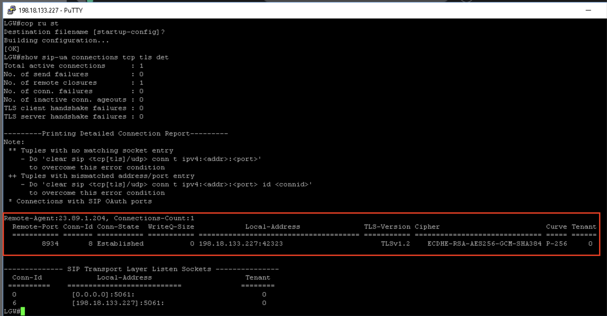
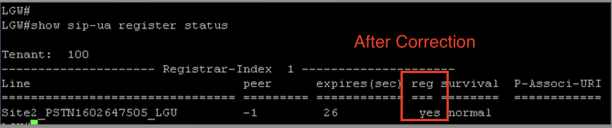
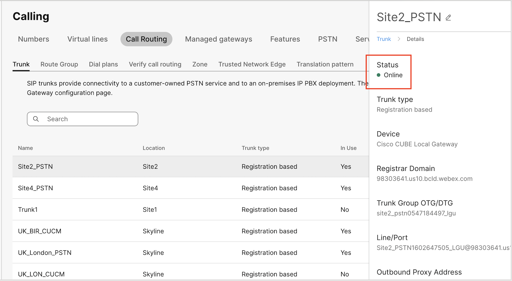
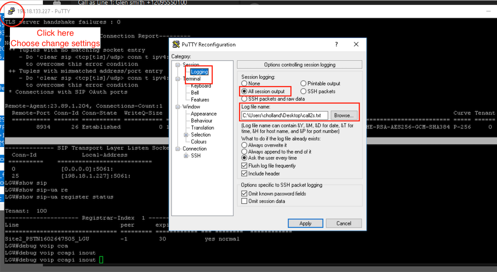
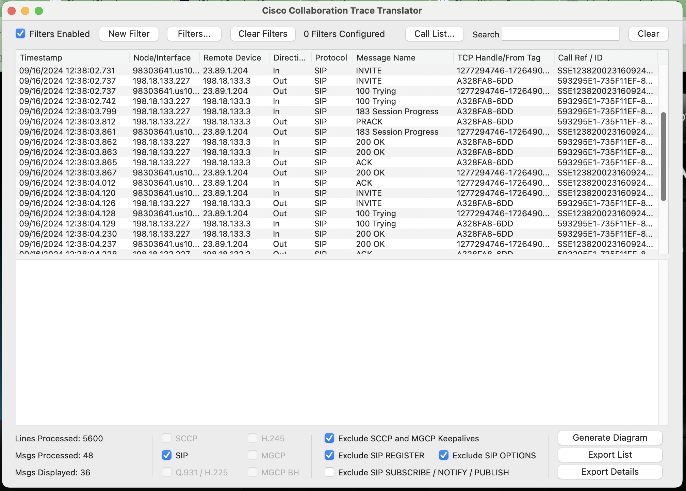
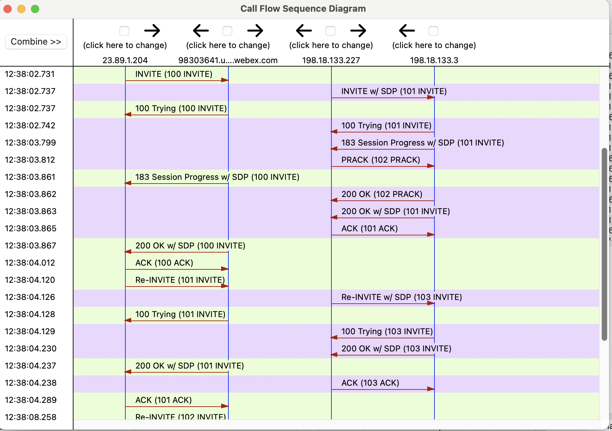
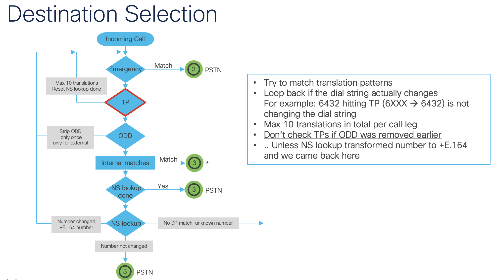

# Lab Debug Calls through Local Gateway

This document will show you how to debug the calls through the local gateway and verify correct operation. Use this guide to troubleshoot your own implementations!

## Step 1 – TLS Registration
 
```
Show sip-ua connections tcp tls detail
```
This will verify the TLS Connection between LGW And Webex calling. If you do not see an active connection, this is generally caused by certificate issues (Not loading the trust certs correctly) or by incorrect crypto configuration or network level firewall issues. If this step is not successful, you will never see any activity on the local gateway itself when trying to make a call.



## Step 2 – SIP Trunk Registration

```
show sip-ua register status
```
This will verify the SIP trunk between LGW and WxC is up. You can also check on control hub. A reg state of “no” usually indicates issues with configuration on the voice tenant – generally with incorrect credentials, realms, usernames etc. If this step is not successful, you will never see any activity on the local gateway itself when trying to make a call. You can use the command debug ccsip non-call to debug the registration operations.





## Step 3 – Dial Peer Selection

With the above steps completed, the next step is to debug the dial peers on the gateway itself to see what is happening. Issue the command
```
debug voip ccapi inout
``` 

This will enable debugging. You can either ensure Terminal monitor is enabled, and log your session output to a file – or you can set the following commands and use show log to see the output of your tests.
```
conf t
no logging console
no logging monitor
logging buffer 999999 debug
end

undebug all
Debug voip ccapi inout
```


Make a call out to pstn, and check the resulting log file. First, we want to look for some text like the below. Filter on the word “incoming” and ensure the correct dial peer is selected (In this case, 100) If it is not, check your incoming URI is correctly specifying the relevant DTG – Details on this below.

!!! code
    ```
    \Sep 16 12:40:18.572: //-1/AA290F15808C/CCAPI/cc\_api\_call\_setup\_ind\_common:
    Interface=0x7FE8742E8208, Call Info(
    Calling Number=12095550100,(Calling Name=)(TON=Unknown, NPI=Unknown, Screening=User, Passed, Presentation=Allowed),
    Called Number=13157244022(TON=Unknown, NPI=Unknown),
    Calling Translated=FALSE, Subscriber Type Str=Unknown, FinalDestinationFlag=TRUE,
    ```
    
    <b>
    
    ```
    Incoming Dial-peer=100, Progress Indication=NULL(0), Calling IE Present=TRUE,
    ```
    
    </b>
    ```
    Source Trkgrp Route Label=, Target Trkgrp Route Label=, CLID Transparent=FALSE), Call Id=208
    ```

To check the correct DPG, enable debug ccsip messages and look for the following text in the inbound SIP invite, ensure it matches your voice class uri 100 sip configuration

!!! code
    \Sep 16 12:40:18.567: //-1/xxxxxxxxxxxx/SIP/Msg/ccsipDisplayMsg:<BR>
    Received:<BR>
    INVITE sip:13157244022@198.18.133.227:5061;transport=tls;<text style="color:red;">dtg=site2_pstn0547184497_lgu</text> SIP/2.0

```
voice class uri 100 sip
pattern dtg=site2_pstn0547184497_lgu
```

With the correct inbound dial peer now selected, let’s check our outbound dial-peer. Look for the following messages in the debug

!!! code
    \Sep 16 12:40:18.574: //208/AA290F15808C/CCAPI/ccCallSetupRequest:<BR>
    Destination=, Calling IE Present=TRUE, Mode=0,<BR>
    <text style="color:red;">Outgoing Dial-peer=900</text>, Params=0x7FE80D9C7CE8, Progress Indication=NULL(0)

If you do not see it, check the configuration of your inbound dial peer has the DPG Set, and the DPG Specifies the outgoing dial peer of 900. This ensures that any calls coming in to dial-peer 100 will automatically be pushed to dial-peer 900 regardless of the digits dialed. The important parts are highlighted in red.

<pre><code>
<text style="color:red;">voice class dpg 100
description INCOMING FROM WXC OUT TO PSTN</text>

dial-peer 900 preference 1
dial-peer voice 100 voip
description Inbound/Outbound Webex Calling
max-conn 250
destination-pattern BAD.BAD
session protocol sipv2
session target sip-server
<text style="color:red;">destination dpg 100</text>
incoming uri request 100
voice-class codec 100
voice-class stun-usage 100
no voice-class sip localhost
voice-class sip tenant 100
dtmf-relay rtp-nte
srtp
no vad

<text style="color:red;">
dial-peer voice 900 voip
description OUTBOUND PSTN PROVIDER
destination-pattern BAD.BAD
session protocol sipv2
session target ipv4:198.18.133.3
voice-class codec 100
dtmf-relay rtp-nte
no vad</text>
</code></pre>

Once we have confirmed correct dial-peer selection, we can move on to SIP message debugging.

## Step 4 – SIP Messages

The final stage is the ensure the correct SIP Messages are being exchanged. For this, it’s useful to use a tool called translatorX <https://translatorx.org/downloads.html>

Leave your Putty session logging all session output to a file, and enable the debug command Debug ccsip messages

Make an outbound call to PSTN and hang up. Now copy the text from the log file into translatorX, or drag the file and drop it into the translatorX window. You will see the SIP Messages represented on screen. Below is an example of a failing call scenario. We can see some looping of messaging going on.  
  


If you click the “Generate diagram” button in the bottom right, we can see a graphical representation of the call flow, where we can start to see what messages are being sent, and from where more easily. This will assist in debugging / troubleshooting issues.



## Longer Extension length and National numbers

!!! curious
    With the inclusion of Extensions up to 10 digits, the chance for overlap on National PSTN numbering becomes more prevalent.​ If the extension exists on Webex Calling, the call will route to the extension number instead of PSTN. If the extension number exists over a Local Gateway trunk on UCM or similar, the call will route to PSTN instead of the extension number. Be aware the behaviour changes depending where the number resides!

 Outbound - If an extension is same as the national number, then the extension takes precedence over the national number. Hence, we recommend that you enable the outbound dial digit to guarantee PSTN egress, as a defined extension could overlap with a “real” Telephone number. See [Outbound Dial Digit and Permissive dialing](https://help.webex.com/en-us/article/pxtu15/Configure-your-Webex-Calling-dial-plan).​
 Inbound – Extensions cannot be used as destinations for inbound PSTN but Webex Calling does provide normalization for some country dial plans to convert a national number to a E164, e.g. US national 10 digit number. If longer extension lengths are used this could conflict with the PSTN dial plan and provide incorrect call classification and failure. In this scenario:​
   PSTN inbound must be normalized to E164 inbound to Webex Calling. This is done automatically by Cloud Connected PSTN.​
   For LGW and Unknown routing to Premise enabled on a Trunk, a large extension length could lead to incorrect Call Classification of Premises and External Calls if E164 is not used for PSTN To and From. See [Calls to On-Premise Extensions Maximum Unknown Extension Length](https://help.webex.com/en-us/article/n0xb944/Configure-trunks,-route-groups,-and-dial-plans-for-Webex-Calling#Cisco_Task_in_List_GUI.dita_fe608e1f-2f05-4369-b758-4b1874b31a3c)

## Dial Plan Behavior – Outside Access Codes & Translation Patterns

Consider the below diagram. Note that translation patterns will not be considered if the outbound dial digit has been previously stripped. As such, you should not translate from numbers, and to numbers that both include an outbound dial digit, as it only gets stripped once.




## Useful Debugging Commands
!!! code
    Show sip-ua connections tcp tls detail<BR>
    Displays status of TCP connection<BR>
    Show sip-ua register status<BR>
    Displays status of SIP Trunks over TCP connection<BR>
    Debug ccsip messages<BR>
    Debugs SIP messages<BR>
    Debug voice ccapi inout<BR>
    Debugs dial-peer matching logic<BR>
    Show voip ice summary<BR>
    Short summary of ICE sessions<BR>
    Show voip ice instance call-id XXXXXX<BR>
    Detailed info on ICE Sessions<BR>
    Show sip-ua calls brief<BR>
    Shows info on active calls, including media IP’s for ICE troubleshooting<BR>
    Debug voip icelib inout<BR>
    Debug ICE Negotiations<BR>
