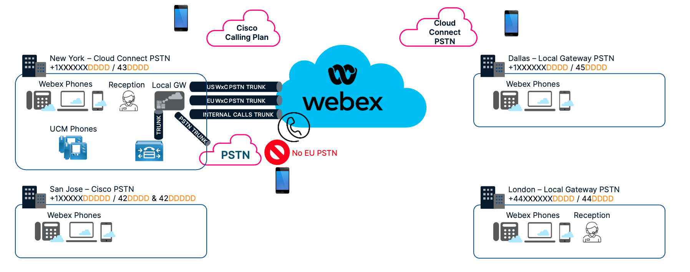

# Lab Learning Objectives

This lab will take you through the setup of four sites with slightly different requirements when it comes to calling. The goals are taken from common customer calling requirements, and you will learn how to configure them in Webex calling MT. Users at this mock company expect to be able to dial each other, and to the PSTN using the same habits they have on their previous system. This lab deals with how to configure those new sites, local gateways, and the resulting dial plan settings to translate and block numbers, route calls correctly, and troubleshoot / test the configurations using built in control hub tools.

## Dialing habits required [2 Minutes]

Users at this mock customer are used to dialing in certain ways. We need to emulate their existing behaviors to minimize the perceived change of the new phone system. After auditing, the customer has requested the following habits to be supported.

* Dial +E.164, send to PSTN
* Dial Full local, send to PSTN
* 0 for Webex Calling Multi Tenant (MT) based local reception
* 4/5-digit short dial between MT Users
* 6/7-digit short dial between MT users
* +E.164 between MT Users
* 4-digit short dial MT to Premises PBX
* 6-digit short dial MT to Premises PBX
* +E.164 to Premises PBX

Note: there could also be some extension number overlap between sites, preventing “pure” 4-digit dialing as there will be duplicate extension numbers across multiple sites. For this, we will configure site routing prefixes in every scenario and talk about the settings we have available to mitigate extension overlap as we run through our scenarios.

## Site information & Topology [1 Minute]

We will be configuring four sites as part of this lab, as detailed in the below table and diagram. The diagram shows how each site’s numbering plan will look and depicts their route to the PSTN. Note that each site can also leverage the internal trunk to dial through to UCM based phones, but this flow is not illustrated on the diagram below. We will get into that later!

|  |  |  |  |
| --- | --- | --- | --- |
| Site | Region | PSTN Connection | Site Routing Code |
| San Jose | USA | Cisco Calling Plan | 42 |
| New York | USA | Cloud Connect | 43 |
| Dallas | USA | Local GW @ NY | 45 |
| London | EMEA | Local GW @ NY | 44 |

