## Lab Site 1 – San Jose [20-30 Minutes]

### Overview
!!! info
      This site represents your typical branch site with a cookie cutter requirement. Users with phones and Webex apps, that need access to PSTN via Cisco Calling Plans PSTN. The customer has variable length dial plan, and requires the users within this site to be able to dial each other using a 4 & 5 digit short dial, dialing the full PSTN number without country code, or using the full +E.164 number. Other users at other sites should be dialable using their 6 digit extensions. They also request to be able to dial 0 to reach a reception desk that is located at New York. The customer also has a requirement to route all calls to unknown extension numbers as internal calls over to a Unified Communications Manager based trunk to premises registered users. The reception desk and internal trunk will be configured later during the New York exercise.

   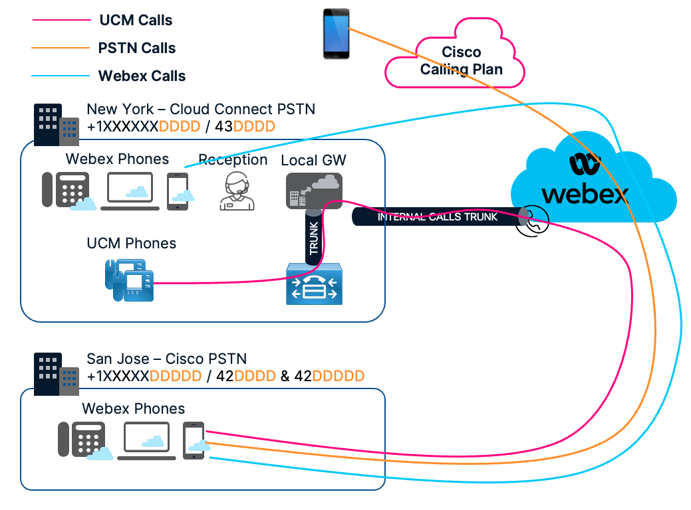

### Configuration Steps

1\. Open RDP connection to Workstation 1 at 198.18.1.36., using **option (A)** or **option (B)** as described above. If needed, Workstation 1 credentials are **dcloud\cholland** and **dCloud123!**

2\. Open Chrome browser from the taskbar. There is also a file on the desktop named “Session\_info.txt”; Open it up now.

3\. From the browser home Page, select **Cisco Webex Links** > **Cisco Webex Control Log in with **cholland@cbXXX.dc-YY.com** and **dCloud*AAAA*!.** Accept all security warnings and welcome prompts! You need to Replace **XXX, YY** and **YYYY** with your session-specific details. Credentials for your session are located in text file Session_Info.txt on Workstation Desktop.

   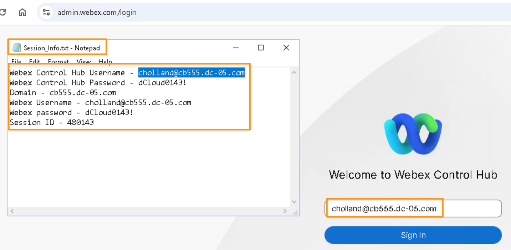
   
4\. For security reasons, **Webex Control Hub** signs out every 20 minutes (Idle timeout) by default. For this lab, let’s make the idle time out longer so the Control Hub does not sign you out often during this lab.

5\. Go to **MANAGEMENT > Organization Settings > Control Hub’s idle timeout.** Drop down the option for **Control Hub idle timeout** and select **12 hours** or **no timeout**. Click **Save**.

   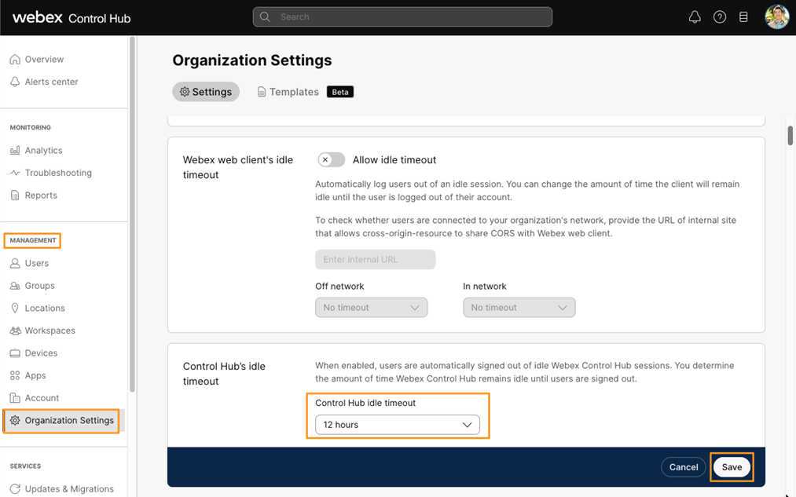

6\. Now, go to **MANAGEMENT** > **Locations.** On the locations page you will see some pre-created locations. Select the location **San Jose**.

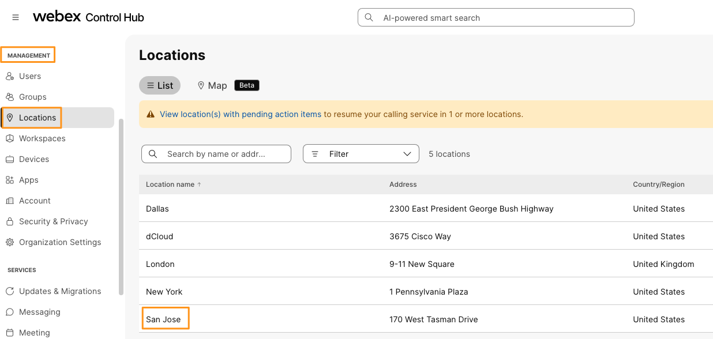

7\. On San Jose location page go to **PSTN** tab. Select **Configure PSTN Services**.

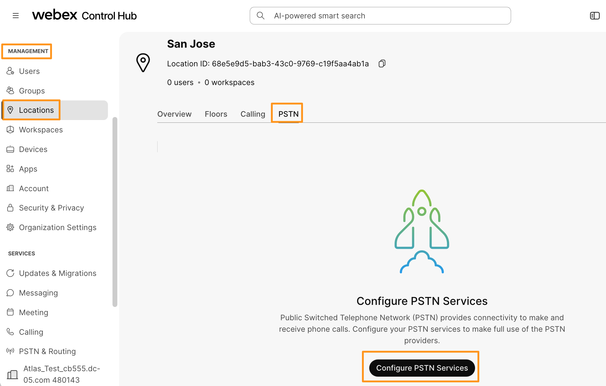

8\. Click **Manage** for PSTN Configuration > PSTN connection.

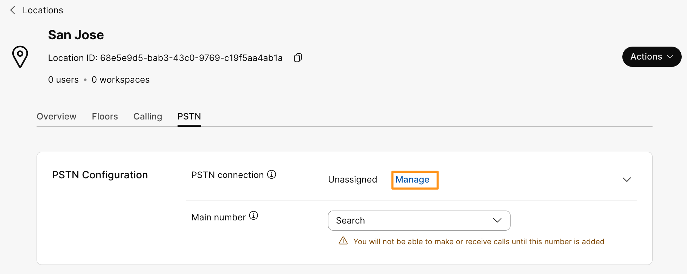

9\.  It will take you to set up PSTN connection type for the **San Jose**. On the **Edit PSTN connection for San Jose** page keep the option selected for **Cisco Calling Plans (CCP)** and select **Next**.

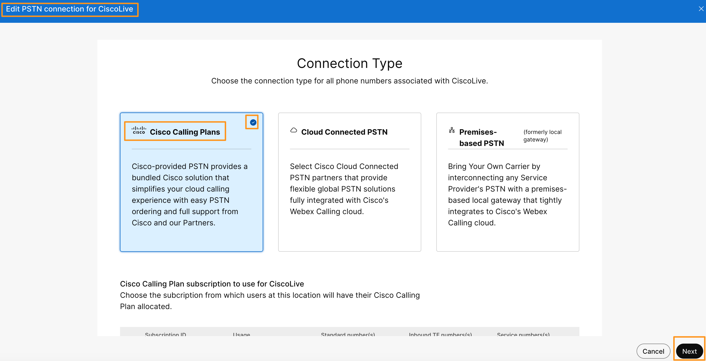

10\. On the following page populate below information and click **Next**.

* First Name: **Charles**
* Last Name: **Holland**
* Email Address: [cholland@cbXXX.dc-YY.com](mailto:cholland@cbXXX.dc-YY.com)
* Confirm Email Address: [cholland@cbXXX.dc-YY.com](mailto:cholland@cbXXX.dc-YY.com)

NOTE: Make sure you replace XXX and YY values from Session\_Info.txt file on Workstation.

   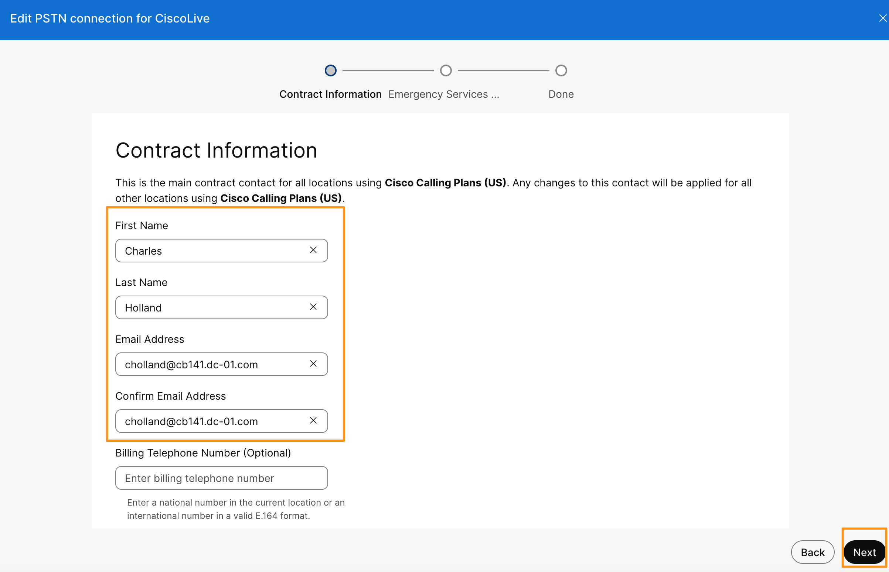

11\. Click **Yes, Change** on the Contract Information Update pop-up window.

12\. On the **Emergency disclaimer** page scroll all the down and enter following information and click **Agree and Continue**.
   * Authorized Contact: Charles Holland
   * Job title: Engineer

13\. On the **Emergency Services Address**, leave all fields default and click **Save**.

14\. Click **Apply** on the address verification pop-up.

15\. Click **Save** (again) or **Done.**

16\. Now the location **San Jose** has been setup to **Cisco Calling Plans** PSTN Connection type.

17\. Click **Add Numbers**

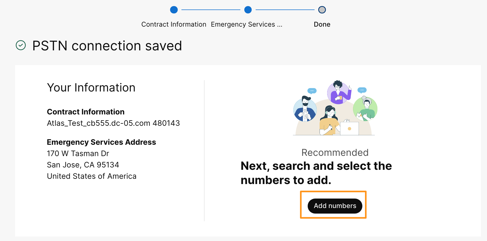

18\. On the **Add Numbers** page, keep **Order New Numbers** selected and click **Next**

19\. On the next page, keep the **State/Province/Region** selected for **California**. Drop down the option for **Area Code** and choose any of the area codes available. For How many numbers do you want to auto-selected for you? enter ***3*** and click **Search.**

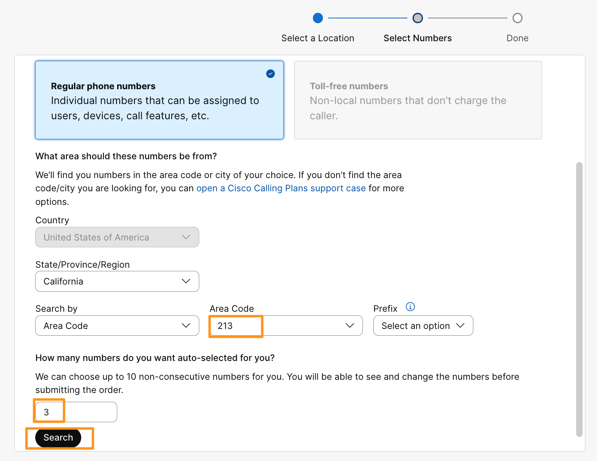

20\. On the next page, Control Hub will select 3 numbers for you. Click **Order**.

21\. It will order 3 new numbers for the location San Jose. Click **View orders**.

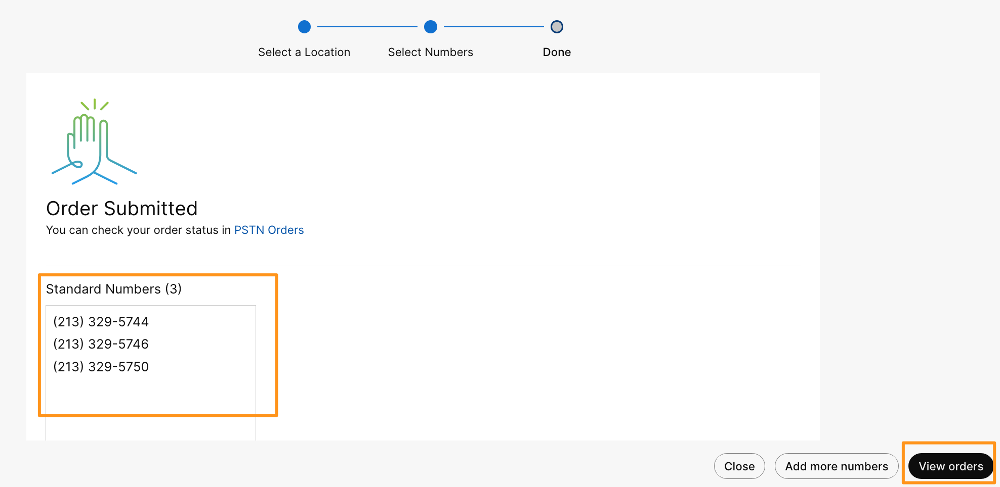

22\. It will take you to **PSTN & Routing** > **PSTN orders** tab/page, click on the order you just placed, and observe the order status, it is should say **Provisioned.** If not, wait 1 minute and try again.

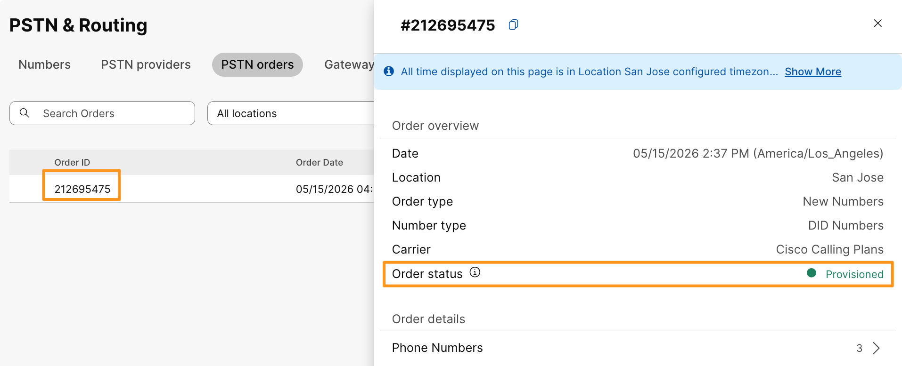

23\. Now on the PSTN & Routing page, go to **Numbers** tab, and observe the three newly placed +E.164 numbers, make sure the Status for all numbers show as **Active**.

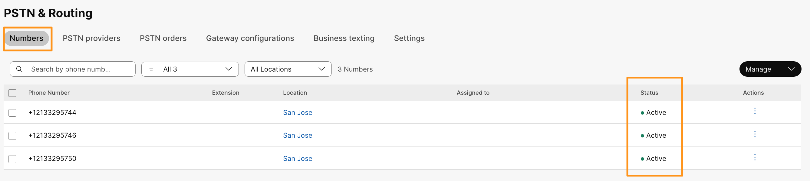

#### Assign Main Number

Now, we must assign a main number to the location. Without this set, Webex Calling will not allow any outgoing calls.

1\. Continuing on Workstation 1, Webex Control Hub. Navigate to **MANAGEMENT** > **Locations**. On the locations page, choose **San Jose** location.

2\. On **San Jose** location page go to **PSTN** tab. On PSTN page, drop down the option for **Main number** and choose any of the available numbers. Click **Save**. The number will still be available for assignment whatever you wish to use it for!

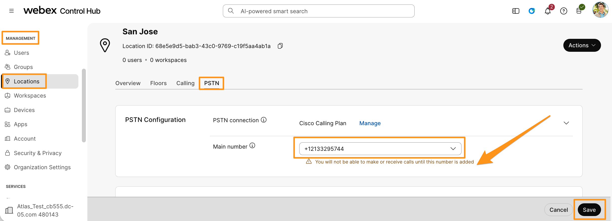

3\. Observe that as soon as you Save the Main number assignment, the warning will disappear, indicating now your location can make and receive calls.

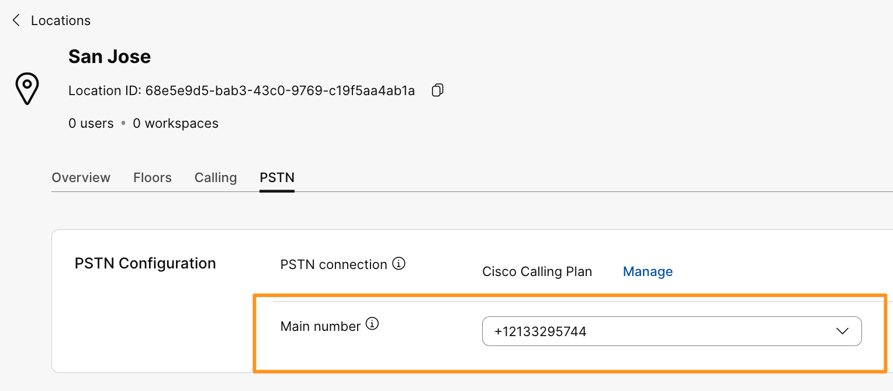

#### Assign numbers to users

For this site, our telephony users will be **Charles Holland** and **Anita Perez**. We must assign them the +E.164 numbers we just ordered. Remember to give Charles a ***four*** digit extension, and Anita a ***five*** digit extension!

1\. Continuing on Workstation 1, Webex Control Hub. Navigate to **MANAGEMENT > Users.** On Users page, choose user **Charles Holland**.

2\. On the Charles Holland user summary page, scroll down a little and click **Edit Licenses**

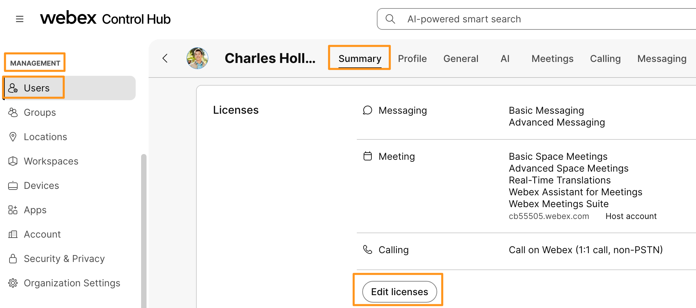

3\. On Edit services for [cholland@cbXXX.dc-YY.com](mailto:cholland@cbXXX.dc-YY.com) page, observe that no “Webex calling professional” license is assigned. Click the **Edit Licenses** button

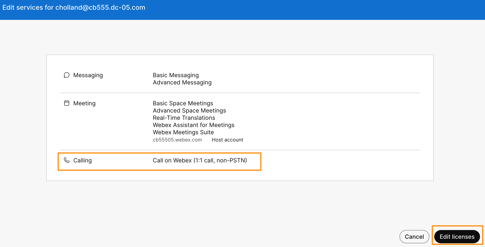

4\. On the next page, go to **Calling** tab, check mark options for **Webex Calling** and **Professional** and click **Save.**

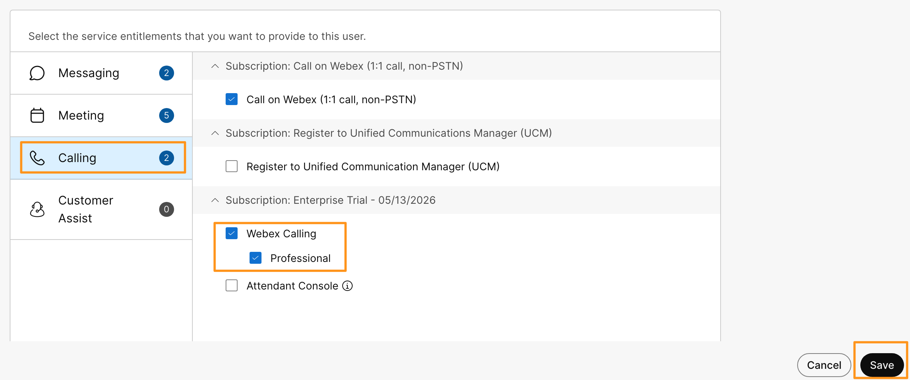

5\. On the next page, drop down the option for **Location** and choose **San Jose**. Now drop down the option for **Phone Number** and choose any +E.164 phone number. For **Extension** enter last 4 digits of the assigned DID number. **Make a note of Charles 4 digit extension number, you will need it later!** Click Save. Click **Close**.

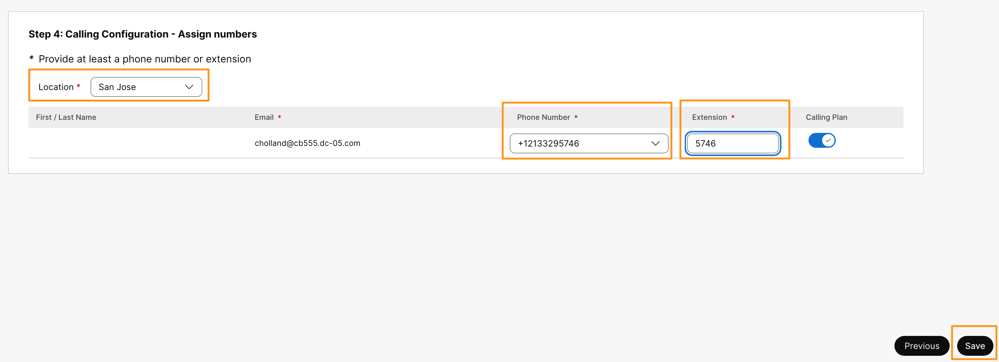

6\. Repeat all the above steps for **Anita Perez** user. Make sure you assign last ***five*** digits of the DID number as extension number. Make a note of this number, you will need it later.

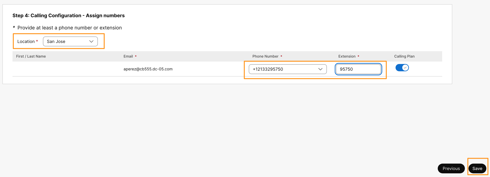

### Test Calls

Now let’s do some initial test calls to validate the existing dial plan before we start modifying things for the customer requirements.

1\. Continuing on Workstation 1, minimize all applications and bring up Webex from desktop. Login as [cholland@cbXXX.dc-YY.com](mailto:cholland@cbXXX.dc-YY.com) & dCloudAAAA! – these details are in your session\_info.txt file. Click **OK** on the Emergency Call Notification window.

**NOTE:** Make sure you replace XXX, YY and AAAA values with your session specific details located in text file called Session\_Info.txt on ***Workstation 1*** Desktop.

   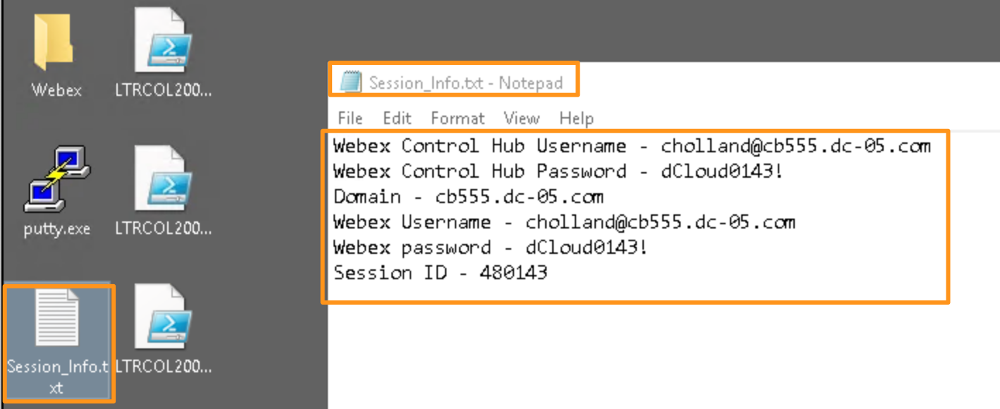

2\. Open RDP connection to Workstation 2, either using **Option A** or **Option B** described in Accessing your Lab section.

* Workstation IP Address: **198.18.1.37**
* Username: **dcloud\aperez**
* Password: **dCloud123!**

3\. Once logged into Workstation 2, bring up Webex and login as [aperez@cbXXX.dc-YY.com](mailto:aperez@cbXXX.dc-YY.com) & dCloudAAAA!. **NOTE:** Make sure you replace XXX, YY and AAAA values with your session specific details located in text file called Session\_Info.txt on ***Workstation 2*** Desktop.

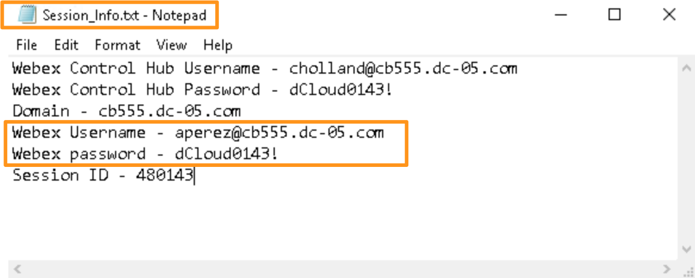

4\. Switch back to Workstation 1, search for **Anita Perez** from Charles Hollands Webex client. Click the green call button for either Audio or Video call, and notice we are dialing the full +E.164 number as per the screenshots. Answer the call on Workstation 2 and make sure the call is successful. Notice the users extension number is shown by Webex as it’s a local user, and not the full +E.164 number. Hangup the call after few seconds.

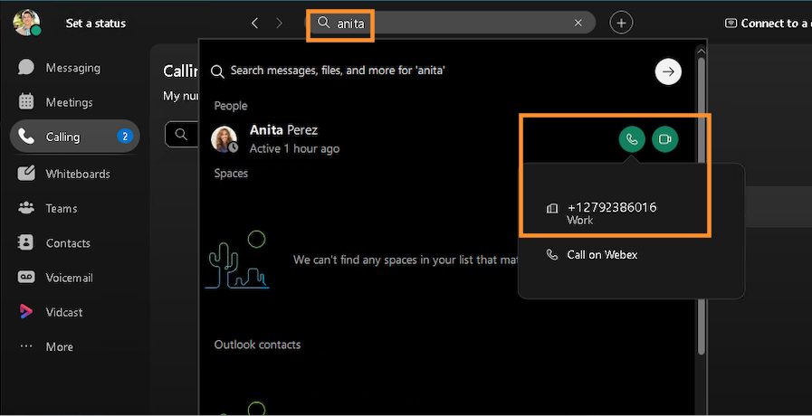

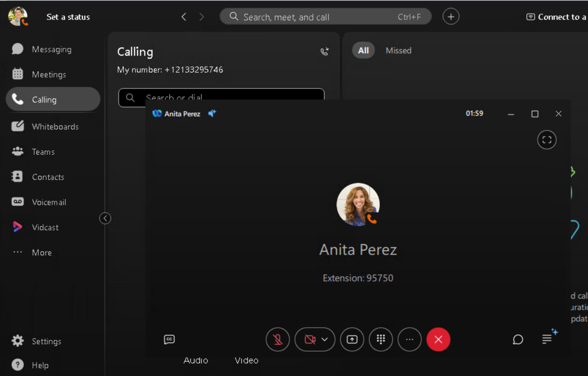

5\. You can try calling PSTN number as well. Do this from Workstation 2. To dial PSTN you can dial either your mobile phone number or Cisco TAC Number +18005532447. If you dial Cisco TAC number, it will be answered by Auto Attendant, after listening to prompt for few seconds you can hang up the call. You don’t need make any selections for Auto Attendant.

6\. Next, try dialing the short dial extensions you configured; we configured 4 digit extension for Charles and 5 digit extension for Anita. So, if you need to dial Anita from Charles Webex dial ***5 digit*** extension (in this example: 95750). If you want to dial Charles from Anita workstation dial ***4 digit*** extension (in this example:5746). These represent your user short code dialing within locations. Hangup the call after few seconds. If you need to get the extension numbers, you can find them within Webex on the Calling tab.  
   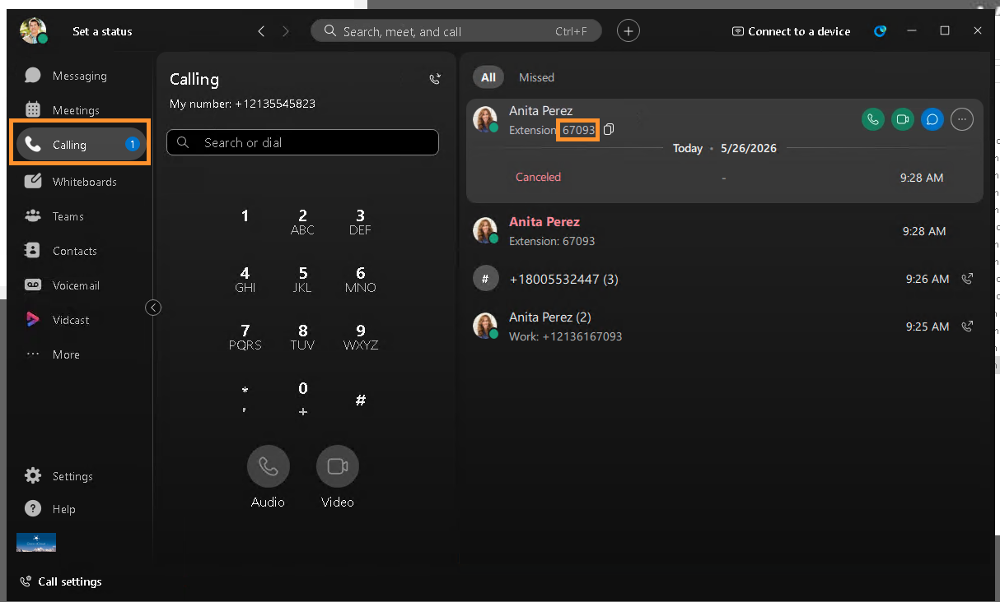

### Configure Base Dial Plan Properties

The customer has given us a “site routing code” of 42 for this site, meaning that users should be reachable using a dial string of 42 + User Extension (In the examples in the screenshots, 42 + 5746 or 42 + 95750 – your extension numbers will be different!) If you try dialing these extension numbers now prefixed by 42, you will notice the call fails, since we didn’t configure site routing codes yet

In production environments with multiple locations, extension overlap can occur—for example, users in different sites may share the same extension. Webex Calling solves this by using Location Routing Prefixes (site routing codes). Each location is assigned a unique prefix, which is automatically prepended to extensions in that location, allowing users across sites to uniquely identify and reach the correct destination without using translation patterns or alternate numbers like in UCM.

1\. Continuing on workstation 1, Webex Control Hub.  Before we configure the Routing Prefix for each location, we need to define some parameters like how long is each Routing Prefix, and the digit each Routing Prefix starts with etc.

2\. On Webex Control Hub, go to **SERVICES** > **Calling**. On the Calling page go to **Settings** tab.

3\. On the **Settings** page click **Edit** for **Internal Dialing**.

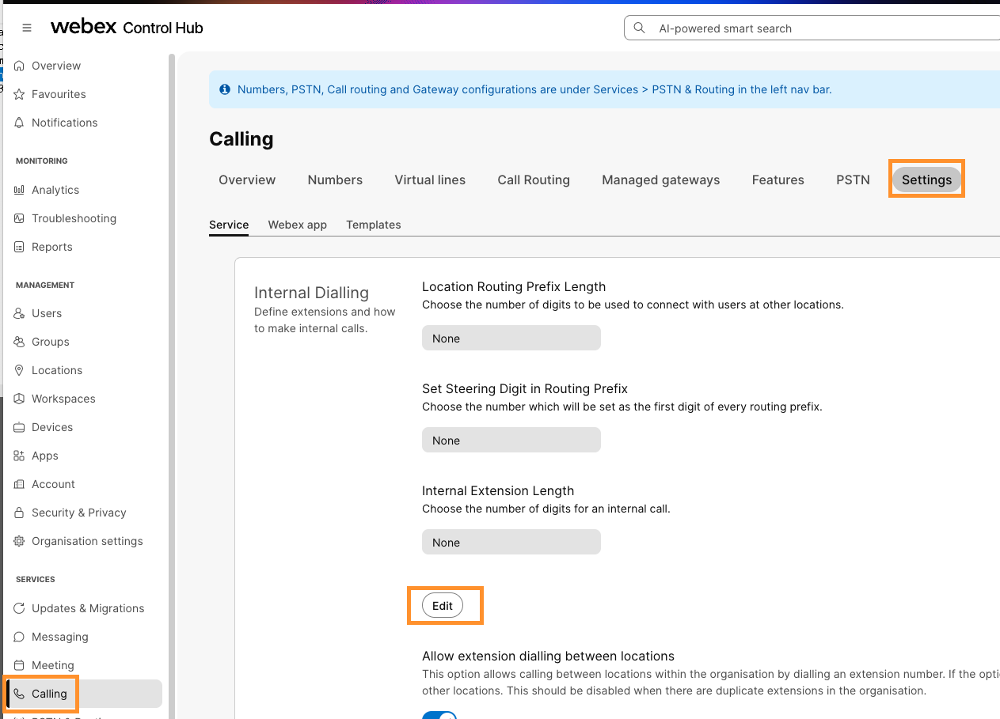

4\. Click **Continue** on **Edit Internal Dialing** pop-up window to confirm that phones need to be restarted for the changes to take effect. On the following page, enter below values and click **Save**.

- Location Routing Prefix Length (number of digits in each Routing Prefix): drop down and choose 2
- Set Steering Digit in Routing Prefix (Starting number for each Routing Prefix): drop down and choose 4
- Internal Extension Length: drop down and choose 4

**NOTE**: If you want to get more details about each parameter you can refer to the URL <https://help.webex.com/en-us/article/pxtu15/Configure-your-Webex-Calling-dial-plan>

   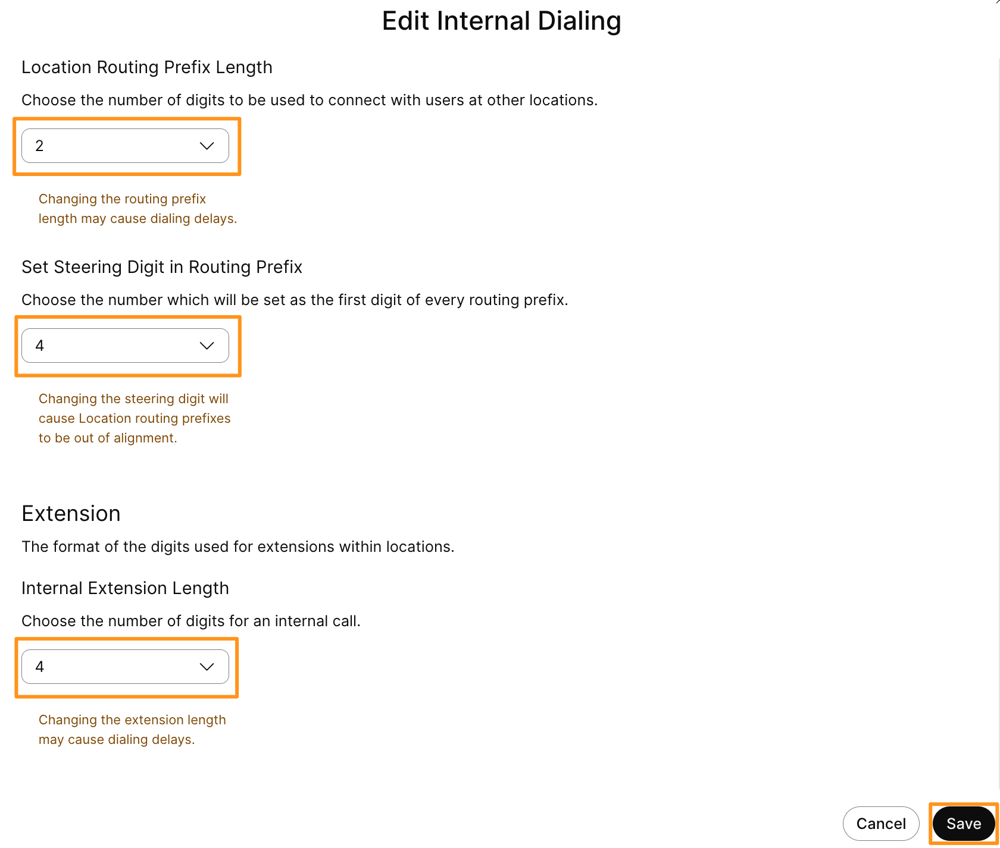

**NOTE**: You can ignore the warnings displayed for each setting.

5\. It will take you back to Settings page, leave **Allow extension dialing between locations** field (under Internal Dialing) Toggled ON. This setting controls if a user can dial between sites without using a site code, with preference being given to a local site match. We will look at this parameter in detail later! For now just make sure its toggled ON.

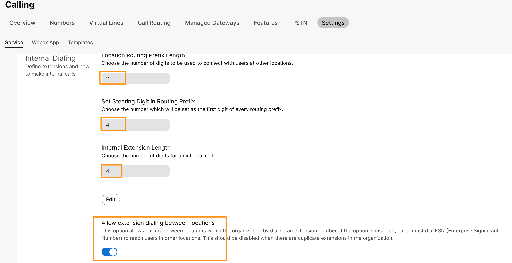

This configures a dial plan for user extensions of 4YXXXX where 4Y is the site code, and XXXX is the last four digits of the full +E.164 number. It is still possible to configure user extensions with something like 8YXXX or 2YXXXXXXX with this setup. It is not recommended, but Webex calling will merely warn the administrator that a user’s extension is outside of the configured range but continue to route calls as best as it can. This caters for our variable length dial plan, as requested for this location. Note that Interdigit timeout delays can occur with variable length dial plans.

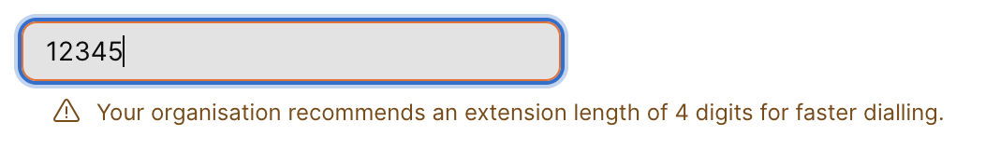

6\. Now let's define the **Routing Prefix** for **San Jose** location. On **Webex Control Hub** go to **MANAGEMENT** > **Locations**.

7\. On the locations page select location **San Jose**. On San Jose location page go to **Calling** tab. On the Calling tab go to **Dialing** > **Internal dialing**.  
   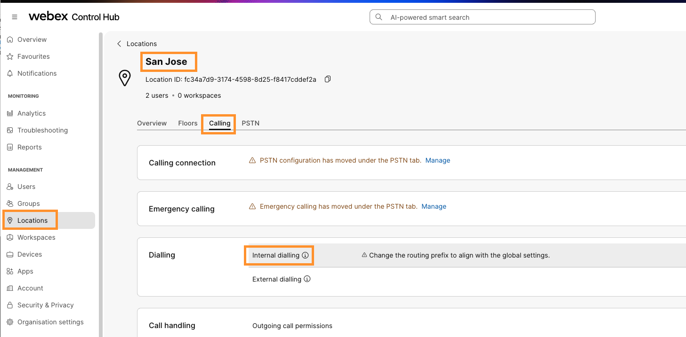

8\. Configure **Routing prefix** as **42**. Observe the dialing preview changes to reflect 42-XXXX and click **Save**.

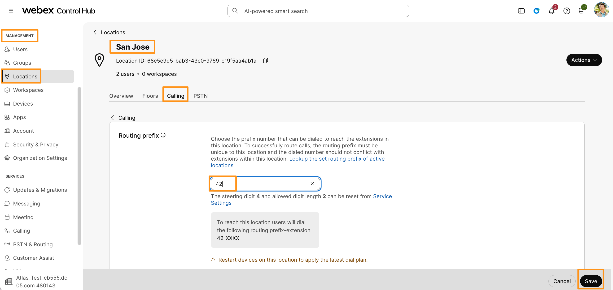

9\. Once you have added routing prefix, all users extension numbers location will be updated with respective routing prefix. To verify users extensions have been updated , on the Control Hub, go to **SERVICES** > **PSTN & Routing** and observe under **Numbers** tab that user extensions are updated with respective **Route prefixes**.

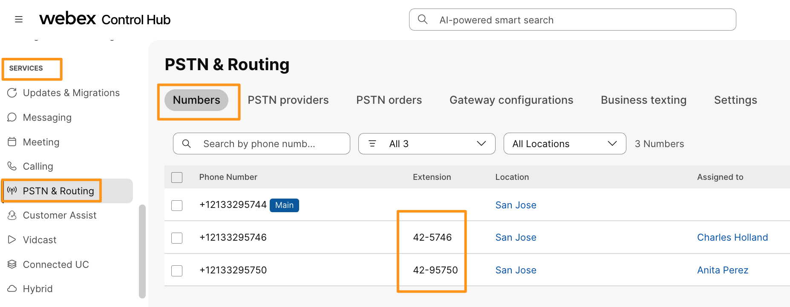

### Test Revised Dial Plan

1\. From control hub, open PSTN & Routing, Numbers tab, and take a note of the 6 and 7 digit extension numbers there for Charles and Anita  
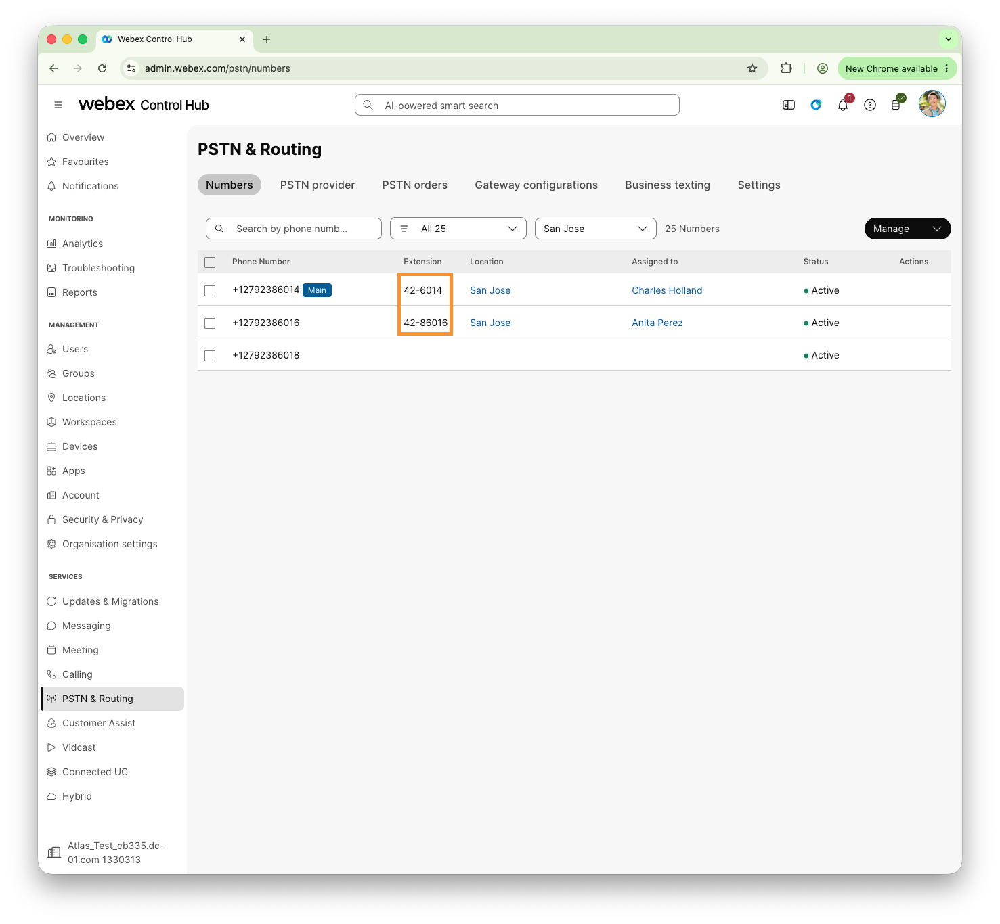

2\. Open workstation 1 and dial Anita’s 7 digit extension. Confirm the call completes properly. Note the call now shows in call history with the full 7 digit extension.  
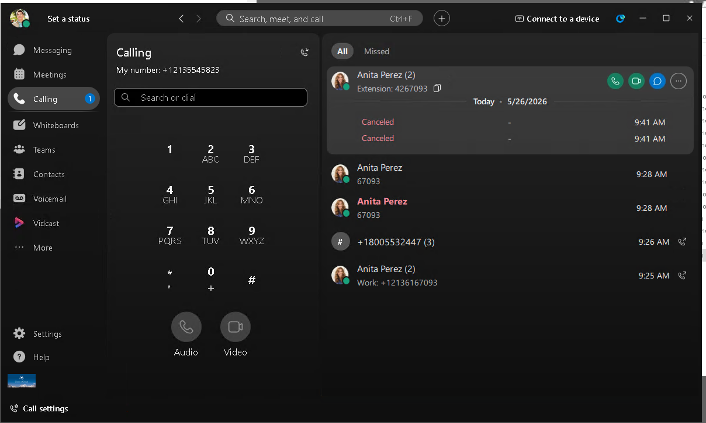

3\. **Optional Step:** Open Workstation 2 and complete the call in the other direction  
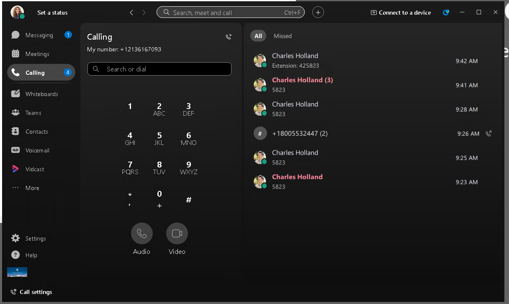